<picture>
  <source media="(prefers-color-scheme: dark)" srcset="./assets/profile-dark.svg">
  <source media="(prefers-color-scheme: light)" srcset="./assets/profile-light.svg">
  
</picture>

<p align="center">
  <a href="mailto:seramogy@yandex.ru"></a>
  <a href="https://t.me/stma19"></a>
  <a href="https://www.youtube.com/@akmixam"></a>
</p>

---

### Hi, I'm Maksim

I am a **QA Engineer** with a developer background. I test web products, APIs and user flows, then turn messy behavior into clear, reproducible reports that teams can actually use.

My sweet spot is the space between **quality, product logic and frontend details**: I notice broken states, unclear flows, weak edge cases and the small things that make software feel unreliable.

---

### Focus

| Product quality | API confidence | Developer mindset |
| --- | --- | --- |
| Functional, smoke and regression testing for web interfaces. | Postman checks, request validation, negative cases and response analysis. | HTML, CSS, JavaScript, React and Git help me understand how issues are built. |

---

### Toolkit

<p align="center">
  
</p>

<p align="center">
  
  
  
  
  
  
</p>

---

### How I work

```text
Explore the product  ->  Find weak points  ->  Reproduce clearly
Check API behavior   ->  Validate states   ->  Report with context
Think like a user    ->  Read like a dev   ->  Improve release quality
```

---

### Current direction

- Building stronger QA fundamentals: **test design, bug reports, regression strategy**
- Improving API testing depth: **Postman, edge cases, data validation**
- Growing toward automation: **JavaScript, Playwright basics, stable checks**
- Exploring **computer vision** and practical AI-assisted workflows

---

<p align="center">
  <b>Open to QA, web testing and junior automation opportunities.</b>
  <br>
  <sub>Russian / English · focused on reliable products and clear communication</sub>
</p>
