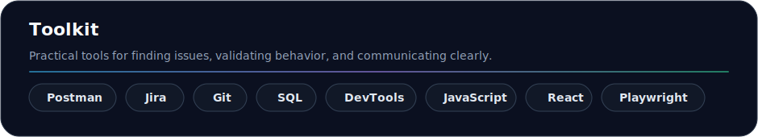

<picture>
  <source media="(prefers-color-scheme: dark)" srcset="./assets/profile-modern-2026-dark.svg">
  <source media="(prefers-color-scheme: light)" srcset="./assets/profile-modern-2026-light.svg">
  
</picture>

<p align="center">
  <a href="mailto:seramogy@yandex.ru"><b>Email</b></a>
  ·
  <a href="https://t.me/stma19"><b>Telegram</b></a>
  ·
  <a href="https://www.youtube.com/@akmixam"><b>YouTube</b></a>
</p>

---

### About

I am **Maksim**, a QA Engineer with a web development background. I test interfaces, APIs, and product flows, then turn confusing behavior into clear reports that are easy to reproduce and fix.

I care about the details that make software feel trustworthy: stable states, predictable flows, readable errors, clean edge cases, and communication that helps the team move faster.

---

### Core Focus

| Quality area | What I do |
| --- | --- |
| **Web testing** | Check UI states, forms, navigation, responsiveness, and user-facing behavior. |
| **API testing** | Validate requests, responses, negative cases, data consistency, and edge behavior. |
| **Regression** | Build focused checklists for stable releases and faster retesting. |
| **Frontend awareness** | Use HTML, CSS, JavaScript, React, Git, and DevTools to understand issues deeper. |

---

<p align="center">
  
</p>

---

### Working Style

```text
Explore product behavior  ->  Find weak points  ->  Reproduce clearly
Validate API contracts    ->  Check edge cases   ->  Report with context
Think like a user         ->  Read like a dev    ->  Improve release quality
```

---

### Now

- Strengthening QA fundamentals: **test design, bug reports, regression strategy**
- Improving API testing depth: **Postman, validation, negative scenarios**
- Moving toward automation: **JavaScript, Playwright, reliable checks**
- Exploring practical AI workflows and computer vision

---

<p align="center">
  <b>Open to QA, web testing, and junior automation opportunities.</b>
  <br>
  <sub>Russian / English · reliable products · clear communication</sub>
</p>
