<picture>
  <source media="(prefers-color-scheme: dark)" srcset="./assets/profile-v4-dark.svg">
  <source media="(prefers-color-scheme: light)" srcset="./assets/profile-v4-light.svg">
  
</picture>

<p align="center">
  <a href="mailto:seramogy@yandex.ru"></a>
  <a href="https://t.me/stma19"></a>
  <a href="https://www.youtube.com/@akmixam"></a>
</p>

---

### About me

I am **Maksim**, a QA Engineer with a web development background. I enjoy catching the little things that break trust in a product: confusing states, weak validation, unstable flows, and bugs that are hard to explain until someone writes them down clearly.

I work close to the product and close to the code: testing interfaces, checking APIs, reading behavior through DevTools, and turning findings into reports that are easy to reproduce and fix.

---

### What I focus on

| Area | What makes it interesting |
| --- | --- |
| **Web testing** | UI states, forms, navigation, responsiveness, cross-browser details |
| **API testing** | Requests, responses, negative scenarios, edge cases, data consistency |
| **Regression** | Focused checklists, release confidence, fast retesting |
| **Frontend mindset** | HTML, CSS, JavaScript, React, Git, DevTools, product behavior |

---

### Tools I use

<p align="center">
  
</p>

<p align="center">
  
  
  
  
  
  
</p>

---

### Workflow

```text
Explore the flow       ->  Notice weak points  ->  Reproduce the issue
Check API behavior     ->  Validate edge cases ->  Add clear context
Think like a user      ->  Read like a dev     ->  Help ship cleaner
```

---

### Now learning

- Stronger QA practice: **test design, checklists, bug reports, regression strategy**
- Deeper API testing: **Postman, validation, negative scenarios**
- Automation direction: **JavaScript, Playwright, stable checks**
- Extra curiosity: **computer vision and AI-assisted workflows**

---

<p align="center">
  <b>Open to QA, web testing, and junior automation opportunities.</b>
  <br>
  <sub>Russian / English · practical quality · clear communication</sub>
</p>
